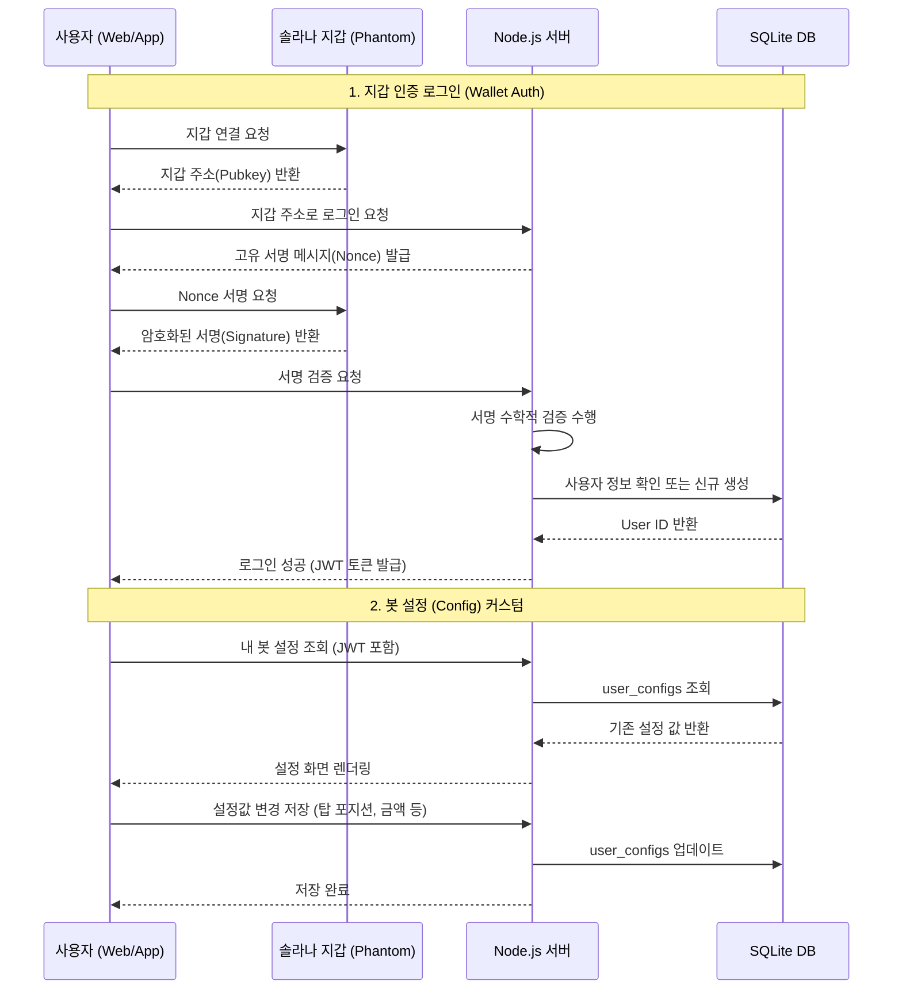
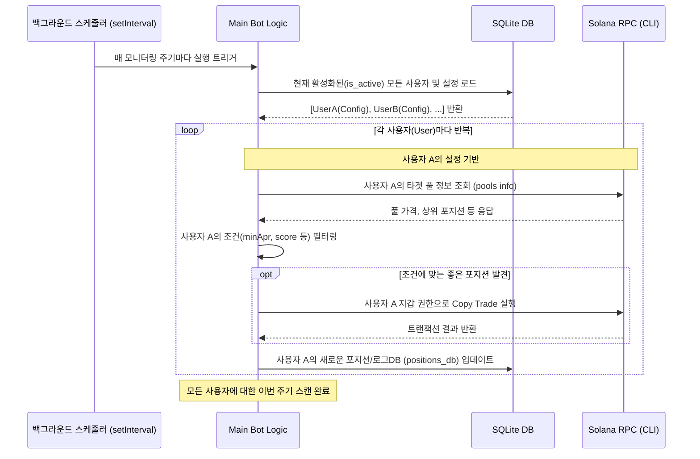

# 🚀 멀티 유저 지원 LP 봇 아키텍처 및 워크플로우

이 문서는 추후 다중 사용자(Multi-User) 환경으로 시스템을 개편할 때 참조할 수 있는 **지갑 인증(Wallet Auth)** 및 **사용자별 봇 실행 워크플로우** 설계도입니다.

## 1. 지갑 로그인 및 설정 변경 (웹/앱 개입)

사용자가 자신의 솔라나 지갑을 연결하여 봇 설정을 조회하고 변경하는 과정입니다.



## 2. 봇 백그라운드 구동 흐름 (멀티 유저)

서버 백그라운드에서 주기적으로(intervalMs) 실행되면서, **각 사용자의 설정(Config)을 불러와 개별적으로 봇 로직을 수행**하는 흐름입니다.



## 🔐 주요 데이터베이스 구조 (Prisma Schema 예시)

다음에 개발을 시작하실 때 사용할 수 있는 `schema.prisma` 코드의 핵심 뼈대입니다.

```prisma
// schema.prisma

generator client {
  provider = "prisma-client-js"
}

datasource db {
  provider = "sqlite" // 초기엔 sqlite, 추후 postgresql로 쉽게 변경 가능
  url      = "file:./dev.db"
}

// 사용자 지갑 정보
model User {
  id            Int         @id @default(autoincrement())
  walletAddress String      @unique
  nonce         String      // 서명 검증을 위한 랜덤 문자열
  createdAt     DateTime    @default(now())
  
  // 1:1 관계
  config        UserConfig? 
}

// 사용자별 상세 설정 (현재 config.js 내용)
model UserConfig {
  id                  Int      @id @default(autoincrement())
  userId              Int      @unique
  user                User     @relation(fields: [userId], references: [id])
  
  // ── 복사 기준 ──
  topN                Int      @default(3)
  maxCopyAttempts     Int      @default(10)
  sortBy              String   @default("score")
  requireInRange      Boolean  @default(true)
  minAprPercent       Float    @default(20.0)
  
  // ── 복사 설정 및 스케줄 ──
  copyAmountUsd       Float    @default(3.0)
  dryRun              Boolean  @default(false)
  intervalMs          Int      @default(1800000)
  
  // JSON으로 유연하게 관리할 항목들 (풀 목록, 충전 토큰)
  pools               String   @default("[]") // JSON String 형태
  autoRechargeTokens  String   @default("[]") // JSON String 형태
}
```

### 💡 다음 스텝 제안
1. **현재 상태 유지:** 오늘은 구조도만 확인하시고, 당장은 하나의 `config.js`를 수정하면서 단일 봇을 고도화시킵니다.
2. **멀티유저 이사 준비:** 추후 준비가 되시면, 이 문서를 기반으로 `npm install @prisma/client prisma` 를 실행해 DB 연동을 가장 먼저 시작하시면 됩니다.
